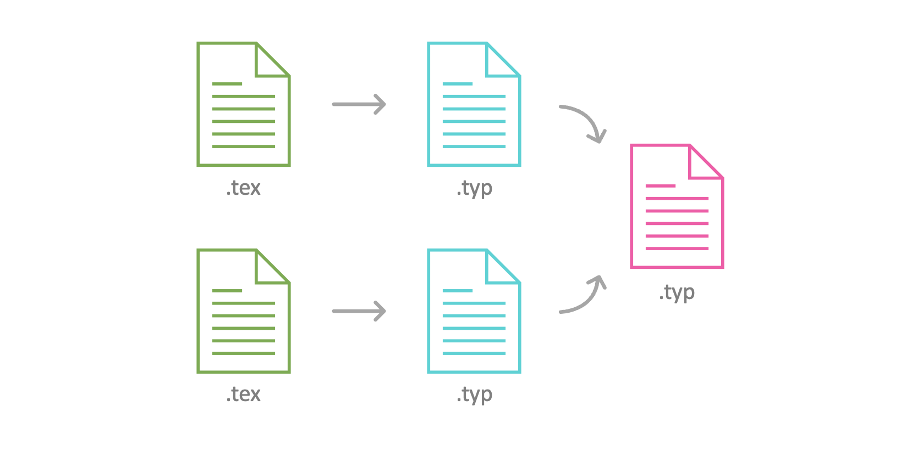
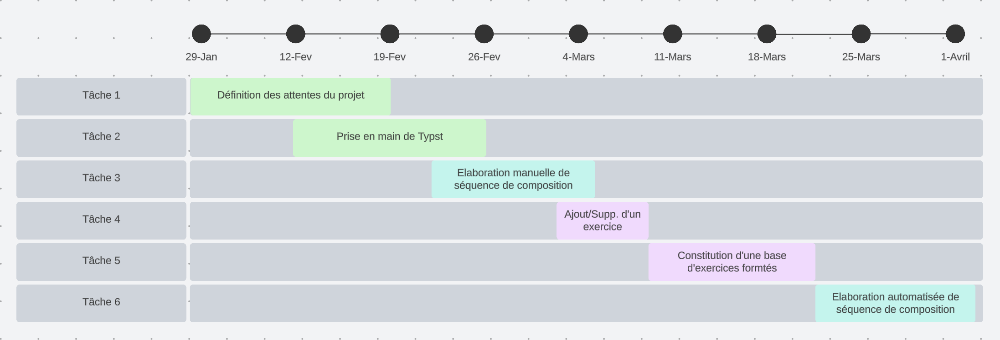
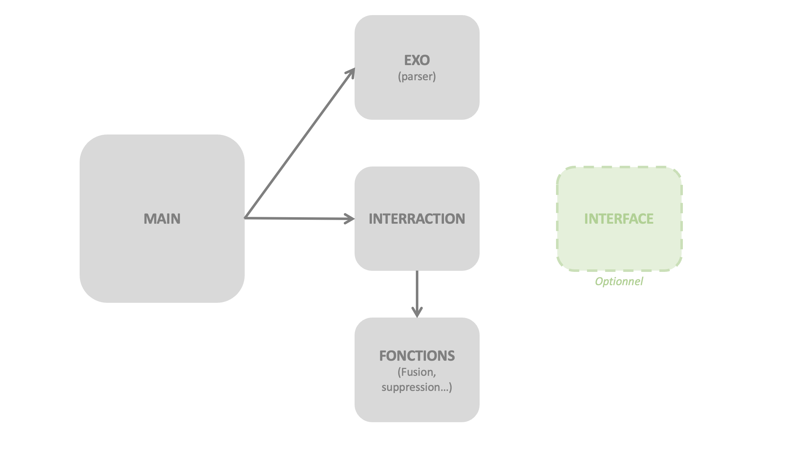

## PROJET INFO4 : Composition de documents d'exercices avec Typst

### Introduction

Notre projet vise à développer un outil innovant dédié à la composition de documents personnalisés à partir de différents sous-documents. Ce logiciel, reposant sur la technologie de composition de documents Typst sera spécialement conçu pour répondre aux besoins variés des enseignants, notamment dans le domaine de l'édition de fiches d'exercices.

### Contexte et objectifs du projet

Imaginez un enseignant disposant d'un riche ensemble d'exercices comprenant solutions et niveaux d'indices variés. Notre objectif est de simplifier le processsus d'élaboration de fiches d'exercices sur mesure, adaptées à un public spécifique et destinées à être converties en document PDF et/ou intégrées à un site web.

Nous utiliseront Typst, un logiciel de composition de documents avancés pour réaliser ce projet.

### Le projet se découpe en plusieurs étapes

* **Définition des attentes du projet :** Phase dédiée à la recherche de la définition exacte du projet, et des attentes des professeurs concernés. (Premières ébauches des questions concernant le projet, récupération de fiches d'exercices type, etc...)
<br>

* **Prise en main de Typst :** Phase consacrée à la prise en main de Typst, où nous explorerons ses fonctionnalités et comprendrons la manipulation de documents LaTeX.
<br>

* **Constitution d'une base d'exercices :** Nous débuterons en créant une base d'exercices, qui servira de référence pour la composition ultérieure.\
*Voir plus de détails : [Base d'exercices](./Base_exercices.md).*
<br>

* **Ajout/suppression d'un exercice :** Ajout/Suppression d'un exercice à la base de données via lignes de commandes.
*Voir plus de détails : [Documentation ligne de commandes](./Doc_Commandes.md).*
<br>

* **Élaboration manuelle de séquences de composition :** Assemblage de 2 exercices .typ pour en faire un seul fichier.


* **Élaboration automatisée de séquences de composition :** Assemblage de plusieurs exercices .typ pour en faire une seule fiche.\
*Voir plus de détails : [Documentation ligne de commandes](./Doc_Commandes.md).*
<br>

* **Traduction de LaTeX vers Typst :** Dans un premier temps, sans les figures construites via LaTeX. On ne prend, dans cette partie, qu'en compte le texte, les images (PNG, JPEG) et les formules mathématiques.
<br>

* **Traduction du code figures LaTeX en Typst :** Parseur permettant de composer les figures LaTex (utilisant la librairie Tikz) en Typst. Exemple d'un code figure à traduire :
  
```tex
\begin{tikzpicture}[->,
                             %yscale=1.3
                             ]
    \tikzstyle{lab}=[fill=white,inner sep=1pt];
    \node[circle,draw] at (0,0) (A) {$x_1$};%
    \node[circle,draw] at (2,0) (B) {$x_2$};%
    \node[circle,draw] at (4,0) (C) {$x_3$};%
    \node[circle,draw] at (0,-2) (D) {$x_4$};%
    \node[circle,draw] at (2,-2) (E) {$x_5$};%
    \node[circle,draw] at (4,-2) (F) {$x_6$};%
    

    \draw (A) edge node[lab]{\scriptsize 16} (B);
    \draw (A) edge node[lab]{\scriptsize 14} (D);
    \draw (A) edge node[lab]{\scriptsize 8} (E);
    \draw (B) edge node[lab]{\scriptsize 2} (C);
    \draw (D) edge node[lab]{\scriptsize 3} (E);
    \draw (E) edge node[lab]{\scriptsize 7} (B);
    \draw (E) edge node[lab]{\scriptsize 1} (F);
    \draw (F) edge node[lab]{\scriptsize 5} (B);
    \draw (F) edge node[lab]{\scriptsize 6} (C);

\end{tikzpicture}
```

* **Modification d'un exercice de la base de données :** Modification d'un seul exercice de la base de données.
<br>

* **Modification d'une fiche d'exercice :** Modification/Suppression/Ajout d'un ou plusieurs exercices d'une fiche d'exercices déjà conçue.
<br>

* **Format de sortie :** Ajout de la possibilité d'obtenir un document en sortie de plusieurs extentions : HTML, PDF...
<br>

* **Ajout d'une interface graphique :** Passage des instructions en ligne de commande sur un terminal, à une interface utilisateur (IHM). Par exemple, visualisation du fichier final, de la base de donnée, glissage de documents pour composition...
<br>

### Projection des étapes réalisées en 2023

Nous ne pourrons pas réaliser toutes les étapes de ce projet en un mois et demi. Nous allons donc nous contenter des parties suivantes :

<div style="background-color: #ddefdd; padding: 10px; border-radius: 10px;">
<span style="color: #008000">Définition des attentes du projet
</div>
<br>

<div style="background-color: #ddefdd; padding: 10px; border-radius: 10px;">
<span style="color: #008000">Prise en main de Typst
</div>
<br>

<div style="background-color: #ddefdd; padding: 10px; border-radius: 10px;">
<span style="color: #008000">Constitution d'une base d'exercices
</div>
<br>

<div style="background-color: #ddefdd; padding: 10px; border-radius: 10px;">
<span style="color: #008000">Ajout/suppression d'un exercice
</div>
<br>

<div style="background-color: #ddefdd; padding: 10px; border-radius: 10px;">
<span style="color: #008000">Élaboration manuelle de séquences de composition
</div>
<br>

<div style="background-color: #ddefdd; padding: 10px; border-radius: 10px;">
<span style="color: #008000">Élaboration automatisée de séquences de composition
</div>
<br>

<div style="background-color: #F9E79F; padding: 10px; border-radius: 10px;">
<span style="color: #B7950B">Traduction de LaTeX vers Typst
</div>
<br>

<div style="background-color: #F9E79F; padding: 10px; border-radius: 10px;">
<span style="color: #B7950B">Traduction du code figures LaTeX en Typst
</div>
<br>

<div style="background-color: #F1948A ; padding: 10px; border-radius: 10px;">
<span style="color: #CB4335">Modification d'un exercice de la base de données
</div>
<br>

<div style="background-color: #F1948A ; padding: 10px; border-radius: 10px;">
<span style="color: #CB4335">Modification d'une fiche d'exercice
</div>
<br>

<div style="background-color: #F1948A ; padding: 10px; border-radius: 10px;">
<span style="color: #CB4335">Format de sortie
</div>
<br>

<div style="background-color: #F1948A ; padding: 10px; border-radius: 10px;">
<span style="color: #CB4335">Ajout d'une interface graphique 
</div>

### Diagramme de Gantt prévisionnel



### Architecture prévisionnelle du code

