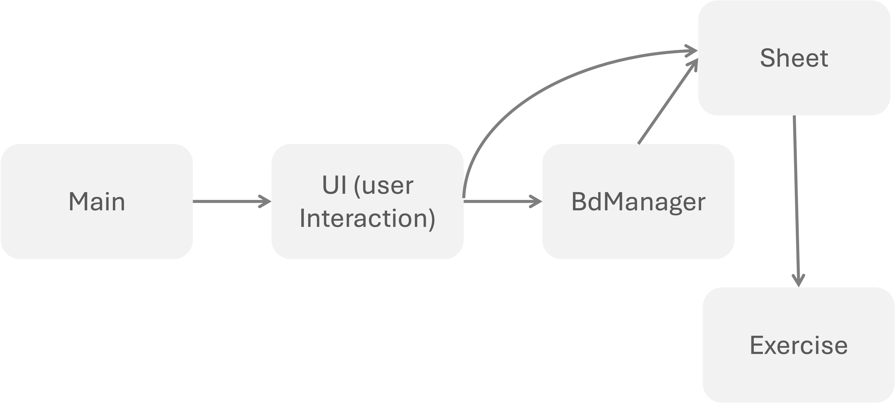

<span style="color:#7B7D7D;">[ FRENCH VERSION BELOW ]

## INFO4 PROJECT : Exercise Document Composition with Typst

### Introduction

Our project aims to develop an innovative tool dedicated to composing personalized documents from various sub-documents. This software, based on the document composition technology Typst, will be specially designed to meet the diverse needs of teachers, particularly in the field of exercise sheet editing.

### Project context and objectives

Imagine a teacher having access to a rich set of exercises including solutions and various levels of hints. Our goal is to simplify the process of creating customized exercise sheets, tailored to a specific audience and intended to be converted into PDF documents and/or integrated into a website.

We will use Typst, an advanced document composition software, to accomplish this project.

### Project breakdown into several steps

* **Project expectations definition:** Phase dedicated to researching the exact definition of the project and the expectations of the concerned teachers. (Initial drafts of project-related questions, retrieval of typical exercise sheets, etc.)
<br>

* **Getting started with Typst:** Phase devoted to getting acquainted with Typst, where we will explore its functionalities and understand the manipulation of LaTeX documents.
<br>

* **Building an exercise base:** We will start by creating an exercise base, which will serve as a reference for future composition.
*See more details: [Exercise Base](./Base_exercices.md).*
<br>

* **Manual composition sequence development:** Assembly of 2 .typ exercises to create a single file.


* **Conversion of a LaTeX exercise into exercise object:** Parsing a LaTeX exercise to turn it into an Exercise object. Metadata is retrieved at the beginning of the file.
<br>

* **Adding/Removing an exercise:** Addition/Deletion of an exercise to/from the database via command lines.
*See more details: [Command Line Documentation](./Doc_Commandes.md).*
<br>

* **Translation of a LaTeX figure code into Typst:** Parser allowing the composition of LaTeX figures (using the Tikz library) into Typst. Example of LaTeX figure code to be translated: 

```tex
\begin{tikzpicture}[->,
                             %yscale=1.3
                             ]
    \tikzstyle{lab}=[fill=white,inner sep=1pt];
    \node[circle,draw] at (0,0) (A) {$x_1$};%
    \node[circle,draw] at (2,0) (B) {$x_2$};%
    \node[circle,draw] at (4,0) (C) {$x_3$};%
    \node[circle,draw] at (0,-2) (D) {$x_4$};%
    \node[circle,draw] at (2,-2) (E) {$x_5$};%
    \node[circle,draw] at (4,-2) (F) {$x_6$};%
    

    \draw (A) edge node[lab]{\scriptsize 16} (B);
    \draw (A) edge node[lab]{\scriptsize 14} (D);
    \draw (A) edge node[lab]{\scriptsize 8} (E);
    \draw (B) edge node[lab]{\scriptsize 2} (C);
    \draw (D) edge node[lab]{\scriptsize 3} (E);
    \draw (E) edge node[lab]{\scriptsize 7} (B);
    \draw (E) edge node[lab]{\scriptsize 1} (F);
    \draw (F) edge node[lab]{\scriptsize 5} (B);
    \draw (F) edge node[lab]{\scriptsize 6} (C);

\end{tikzpicture}
```

* **Database exercise modification:** Modification of a single exercise in the database.
<br>

* **Exercise sheet modification:** Modification/Deletion/Addition of one or more exercises in an already designed exercise sheet.
<br>

* **Output format:** Addition of the possibility to obtain a document in multiple formats: HTML, PDF, etc.
<br>

* **Adding a graphical user interface (GUI):** Transitioning from command-line instructions to a user interface (UI). For example, visualization of the final file, the database, document dragging for composition, etc.

<br>

### Forecasted steps accomplished in 2024

We won't be able to complete all the steps of this project in one and a half months. Therefore, we will focus on the following parts:


### Predicted Gantt chart


### Predicted code architecture



### Project automaton


<br>
<br>

<span style="color:#7B7D7D;">[ FRENCH VERSION ]

## PROJET INFO4 : Composition de documents d'exercices avec Typst

### Introduction

Notre projet vise à développer un outil innovant dédié à la composition de documents personnalisés à partir de différents sous-documents. Ce logiciel, reposant sur la technologie de composition de documents Typst sera spécialement conçu pour répondre aux besoins variés des enseignants, notamment dans le domaine de l'édition de fiches d'exercices.

### Contexte et objectifs du projet

Imaginez un enseignant disposant d'un riche ensemble d'exercices comprenant solutions et niveaux d'indices variés. Notre objectif est de simplifier le processsus d'élaboration de fiches d'exercices sur mesure, adaptées à un public spécifique et destinées à être converties en document PDF et/ou intégrées à un site web.

Nous utiliseront Typst, un logiciel de composition de documents avancés pour réaliser ce projet.

### Le projet se découpe en plusieurs étapes

* **Définition des attentes du projet :** Phase dédiée à la recherche de la définition exacte du projet, et des attentes des professeurs concernés. (Premières ébauches des questions concernant le projet, récupération de fiches d'exercices type, etc...)
<br>

* **Prise en main de Typst :** Phase consacrée à la prise en main de Typst, où nous explorerons ses fonctionnalités et comprendrons la manipulation de documents LaTeX.
<br>

* **Constitution d'une base d'exercices :** Nous débuterons en créant une base d'exercices, qui servira de référence pour la composition ultérieure.\
*Voir plus de détails : [Base d'exercices](./Base_exercices.md).*
<br>

* **Élaboration manuelle de séquences de composition :** Assemblage de 2 exercices .typ pour en faire un seul fichier.


* **Conversion d'un exercice LaTeX en objet Exercise :** Parsing d'un exercice LaTeX pour en faire un objet Exercise. On récupère les métadonnées en début de fichier.
<br>

* **Ajout/suppression d'un exercice :** Ajout/Suppression d'un exercice à la base de données via lignes de commandes.
*Voir plus de détails : [Documentation ligne de commandes](./Doc_Commandes.md).*
<br>

* **Traduction du code figures LaTeX en Typst :** Parseur permettant de composer les figures LaTex (utilisant la librairie Tikz) en Typst. Exemple d'un code figure à traduire :
  
```tex
\begin{tikzpicture}[->,
                             %yscale=1.3
                             ]
    \tikzstyle{lab}=[fill=white,inner sep=1pt];
    \node[circle,draw] at (0,0) (A) {$x_1$};%
    \node[circle,draw] at (2,0) (B) {$x_2$};%
    \node[circle,draw] at (4,0) (C) {$x_3$};%
    \node[circle,draw] at (0,-2) (D) {$x_4$};%
    \node[circle,draw] at (2,-2) (E) {$x_5$};%
    \node[circle,draw] at (4,-2) (F) {$x_6$};%
    

    \draw (A) edge node[lab]{\scriptsize 16} (B);
    \draw (A) edge node[lab]{\scriptsize 14} (D);
    \draw (A) edge node[lab]{\scriptsize 8} (E);
    \draw (B) edge node[lab]{\scriptsize 2} (C);
    \draw (D) edge node[lab]{\scriptsize 3} (E);
    \draw (E) edge node[lab]{\scriptsize 7} (B);
    \draw (E) edge node[lab]{\scriptsize 1} (F);
    \draw (F) edge node[lab]{\scriptsize 5} (B);
    \draw (F) edge node[lab]{\scriptsize 6} (C);

\end{tikzpicture}
```

* **Modification d'un exercice de la base de données :** Modification d'un seul exercice de la base de données.
<br>

* **Modification d'une fiche d'exercice :** Modification/Suppression/Ajout d'un ou plusieurs exercices d'une fiche d'exercices déjà conçue.
<br>

* **Format de sortie :** Ajout de la possibilité d'obtenir un document en sortie de plusieurs extentions : HTML, PDF...
<br>

* **Ajout d'une interface graphique :** Passage des instructions en ligne de commande sur un terminal, à une interface utilisateur (IHM). Par exemple, visualisation du fichier final, de la base de donnée, glissage de documents pour composition...
<br>

### Projection des étapes réalisées en 2024

Nous ne pourrons pas réaliser toutes les étapes de ce projet en un mois et demi. Nous allons donc nous contenter des parties suivantes :


### Diagramme de Gantt prévisionnel


### Architecture prévisionnelle du code


### Automate du projet 

